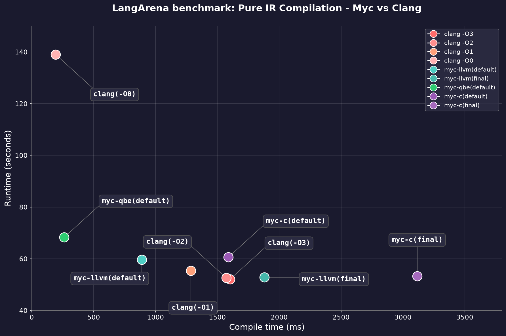
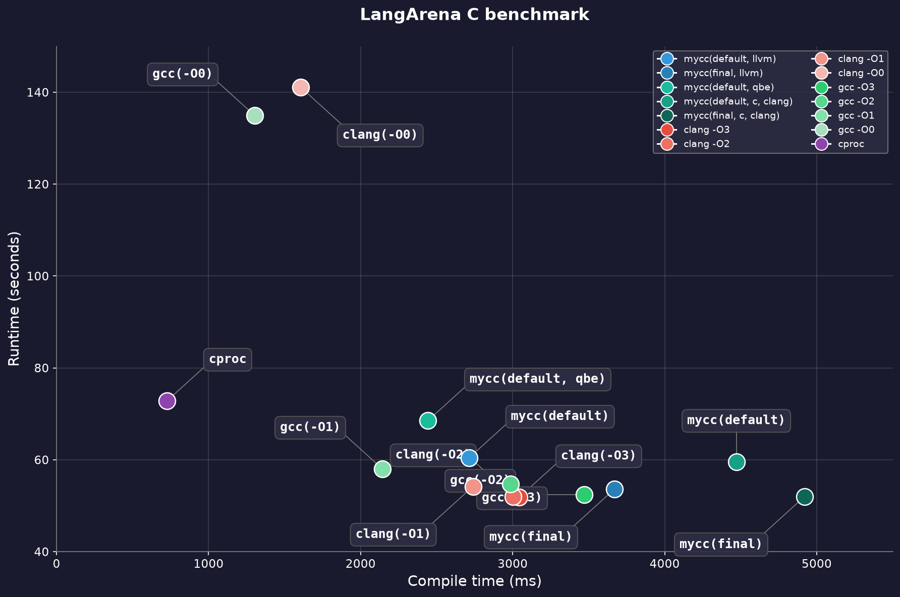

# Set of Benchmarks for [myc](https://github.com/kostya/myc).

Running on Ryzen 3800x and ubuntu 24.04. Add `myc-llvm`, `myc-qbe`, `myc-c`, `mycc` to Path.

```
git clone https://github.com/kostya/myc-benchmarks.git
cd myc-benchmarks
```

# LangArena Benchmark:

[LangArena](https://github.com/kostya/LangArena) is a benchmark suite of 50 tests and 9,000 lines of non-trivial C code (json, base64, multithreaded matmul, neural net, compression, maze A*, bf interpreter, and others) with heavy macros like uthash. The `./c` directory contains 29 `.c` files (230KB total), which we'll use for comparison. This is not just a random benchmark of micro-optimizations or synthetic loops - it's a set of tasks close to production use. Each of the 50 tests validates its output using checksums. A compiler can't "cheat" by deleting or skipping work.

### Fetch and Build deps
```
cd LangArena/c; make MODE=prod target/deps/prod/yyjson.o target/deps/prod/libbase64.o; cd -
```

## Benchmark 1: LangArena single IR file Myc vs Clang.

Compile LangArena C benchmark, from single IR file (to remove parsing overhead). Both MYC [LangArena/langarena-single-myc/langarena.myc](https://github.com/kostya/myc-benchmarks/blob/master/LangArena/langarena-single-myc/langarena.myc) and LL [LangArena/langarena-single-ll/langarena.ll](https://github.com/kostya/myc-benchmarks/blob/master/LangArena/langarena-single-ll/langarena.ll) represent the same program and both generated from the same 29 C files (in ./LangArena/c folder) in O0 mode without any processing (by scripts `LangArena/gen_myc.rb` and `LangArena/gen_ll.rb`, files in the repo was generated for linux64, for macOS need to regenerate with this scripts). This benchmark shows raw optimization and code generation skills for both engines.

`Ubuntu clang version 20.1.2 (0ubuntu1~24.04.3)` vs `myc 0.10.0-dev-4e16e50 LLVM 20.1.2`

```
cd LangArena; ruby run_single_ir_benchmark.rb; cd -
```

| Compiler | Compile time | Runtime |
|:-------|-------------:|-----:|
| clang(-O3, ll) | 1603ms | 52.1s |
| clang(-O2, ll) | 1572ms | 52.6s |
| clang(-O1, ll) | 1286ms | 55.4s |
| clang(-O0, ll) | 193ms | 139.0s |
| myc-llvm(default) | 889ms | 59.6s |
| myc-llvm(final) | 1880ms | 52.8s |
| myc-qbe(default) | 262ms | 68.3s |
| myc-c(default, clang) | 1589ms | 60.6s |
| myc-c(final, clang) | 3115ms | 53.3s |

1. myc-qbe(default) - compiles only 35% slower than Clang -O0 (262ms vs 193ms), and 6x faster than Clang -O3 (262ms vs 1603ms). Despite near-instant compilation, runtime is only 31% slower than Clang -O3 (68.3s vs 52.1s). myc-qbe delivers a tradeoff that even Go would envy.

2. myc-llvm(default) - 1.8x faster compilation than Clang -O3 (889ms vs 1603ms), with runtime only 14% slower (59.6s vs 52.1s). A solid balance: fast compiles, decent performance.

3. myc-llvm(final) - runtime is nearly identical to Clang -O3 (52.8s vs 52.1s, just 1.3% slower), but compilation takes 17% longer (1880ms vs 1603ms). LLVM spends ~280ms more optimizing Myc-generated IR - needs investigation.

4. myc-c - adds overhead by generating C code and compiling it through the full Clang stack, so it can't compete with the other two backends on compile time. It's primarily a fallback backend for portability. Runtime is respectable: 60.6s default, 53.3s final - within 2% of Clang -O3 when using clang as the final compiler.



This scatter plot shows the tradeoff between compile time and runtime. The ideal is the bottom-left corner: fast compiles, fast runtime. This is the Pareto frontier - you can't improve one without sacrificing the other. Myc-qbe(default) and myc-llvm(default) occupy a spot that even Go would respect. Measured on pure IR files - no parsing overhead, just optimization and code generation for both MycIR and LLVM-LL.

## Benchmark 2: LangArena C benchmark - Myc,Clang,Gcc,Cproc.

This benchmark compiles the C files in `LangArena/c` dir (excluding two precompiled dependencies: yyjson.o and libbase64.o). All files are compiled at once, not one by one (`clang LangArena/c/src/*.c`), to remove the overhead of multiple command invocations.

`mycc 0.10.0-dev-4e16e50 c99-subset compiler (backend: unknown) (https://github.com/kostya/myc)`, `gcc (Ubuntu 13.3.0-6ubuntu2~24.04.1) 13.3.0`, `Ubuntu clang version 20.1.2 (0ubuntu1~24.04.3)`, `cproc master`

```
cd LangArena; ruby run_c_benchmark.rb; cd -
```

| Compiler | Compile time | Runtime |
|:-------|-------------:|-----:|
| mycc(default, llvm) | 2713ms | 60.4s |
| mycc(final, llvm) | 3669ms | 53.6s |
| mycc(default, qbe) | 2442ms | 68.5s |
| mycc(default, c, clang) | 4471ms | 59.5s |
| mycc(final, c, clang) | 4920ms | 52.0s |
| clang(-O3, c) | 3042ms | 51.8s |
| clang(-O2, c) | 3001ms | 52.0s |
| clang(-O1, c) | 2739ms | 54.2s |
| clang(-O0, c) | 1605ms | 141.1s |
| gcc(-O3, c) | 3470ms | 52.4s |
| gcc(-O2, c) | 2986ms | 54.7s |
| gcc(-O1, c) | 2143ms | 58.0s |
| gcc(-O0, c) | 1304ms | 134.9s |
| cproc | 726ms | 72.8s |

1. Parsing is the real bottleneck for clang. Compare Clang -O0 on C (1605ms) vs Clang -O0 on LLVM IR (193ms). 88% of Clang's compile time is spent on parsing C and generating IR, not on optimization or codegen. Shocking O_o.

2. cproc proves fast C parsing is possible. cproc compiles the same C code in 726ms - 2.2x faster than Clang -O0. Runtime is only 40% slower than Clang -O3 (72.8s vs 51.8s). As we saw earlier from myc-qbe results, QBE (cproc's backend) spends ~262ms on codegen, meaning cproc's parsing itself is roughly ~464ms.

3. mycc doesn't shine in this benchmark. mycc relies on libclang for parsing, and has very rough frontend implementation (3-week POC), not a production C frontend.

4. GCC has better O0->O3 scaling. 


